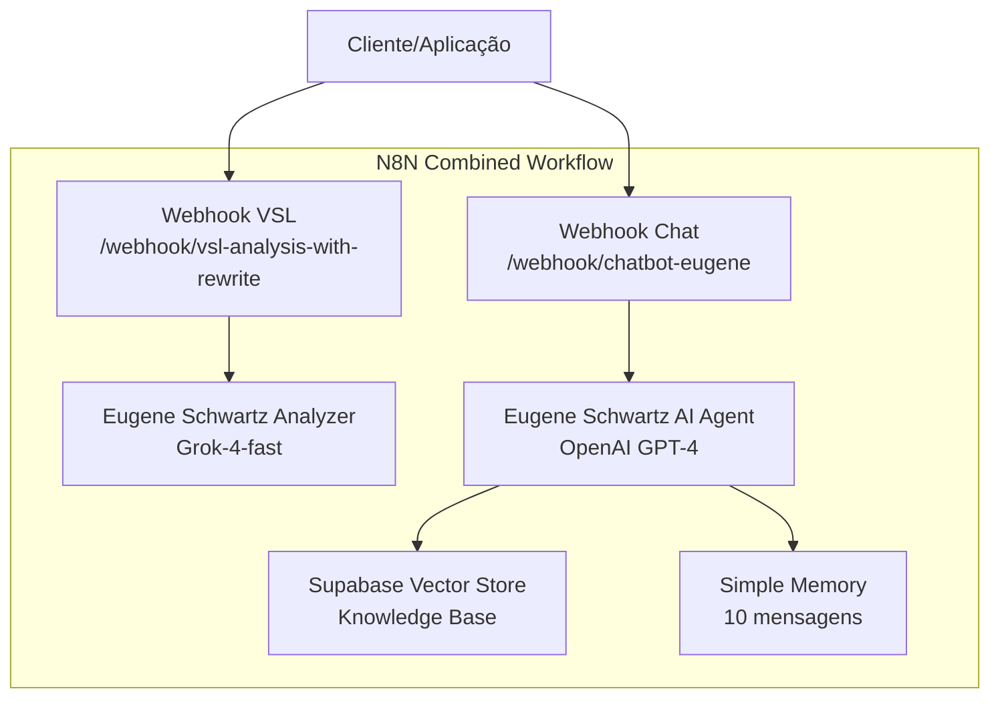
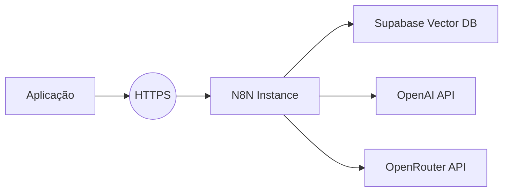

# Arquitetura N8N - Eugene Schwartz

## Workflow Combinado

## Fluxos de Dados

### VSL Analysis
1. **Input** → Webhook → Normalize → Eugene Analyzer → Structured Parser → **Output JSON**

### Chatbot
2. **Input** → Webhook → Prepare → Eugene Agent → Vector Search + Memory → **Response JSON**

## Componentes Principais

| Componente | Função |
|------------|--------|
| **Webhooks** | `/webhook/vsl-analysis-with-rewrite` e `/webhook/chatbot-eugene` |
| **Eugene Schwartz Analyzer** | Análise VSL com Grok-4-fast |
| **Eugene AI Agent (Chat)** | Chatbot com OpenAI GPT-4 |
| **Supabase Vector Store** | Knowledge base Eugene Schwartz |
| **Simple Memory** | Contexto conversacional (10 mensagens) |
| **Structured Output Parser** | Garantia de JSON válido |

## Deploy

---

**Workflow completo:** `[Vita_Science]Combined_Workflow_Eugene.json`